<picture>
  <source media="(prefers-color-scheme: dark)" srcset="banner-dark.svg">
  
</picture>

Backend and tooling engineer — **Python** and **Rust**. APIs, search, automation,
and the occasional language tool. Yerevan, Armenia.

## Now

_Updated: September 2026_

- **Python** — [`asyncord`](https://github.com/vadim-su/asyncord), an async Discord API
  library, and [`fbenum`](https://github.com/vadim-su/fbenum), pydantic-compatible
  fallback enums. FastAPI and Postgres are still my default way to ship a service.
- **Search and document pipelines** — indexing heterogeneous documents (PDF, Word)
  and making them actually findable.
- **Rust** — small sharp tools: [`rust_cv`](https://github.com/vadim-su/rust_cv), plus
  language-tooling side quests when a language I like has no editor support yet.
- **AI coding agents** — running MCP-native agent runtimes daily, filing issues and
  patches upstream instead of building another wrapper.
- **Desktop tinkering** — [`omarchy-linear-widget`](https://github.com/vadim-su/omarchy-linear-widget):
  a QML bar widget that pulls Linear issues into Omarchy/Hyprland and opens the matching
  git worktree.
- **Unreleased** — a few things I build for myself in the background: developer tooling
  and CLIs, plus search over my own documents. Rust where it has to be fast, Python
  where it has to be flexible. They land here once they stop being embarrassing.

## Projects

| Project | What it is | Status |
| --- | --- | --- |
| [`asyncord`](https://github.com/vadim-su/asyncord) | Async Discord API library for Python | maintenance mode, contributors welcome |
| [`fbenum`](https://github.com/vadim-su/fbenum) | Fallback enums for Python, pydantic-compatible | stable |
| [`rust_cv`](https://github.com/vadim-su/rust_cv) | My CV as a Rust web app | side project |
| [`omarchy-linear-widget`](https://github.com/vadim-su/omarchy-linear-widget) | Linear issues in the Omarchy bar (QML), worktree-aware | active |
| [`zed_mojo`](https://github.com/vadim-su/zed_mojo) / [`tree-sitter-mojo`](https://github.com/vadim-su/tree-sitter-mojo) | Editor support for the Mojo language | active |
| [`ferron_zed`](https://github.com/vadim-su/ferron_zed) / [`ferron_tree_sitter`](https://github.com/vadim-su/ferron_tree_sitter) | Same idea, for Ferron | active |

## Tech

- **Languages:** Python · Go · Rust
- **Around them:** FastAPI, Postgres, Elasticsearch, Docker, QML/Quickshell
- **Interests:** APIs, search, automation, agent runtimes

## Setup

Omarchy (Arch + Hyprland) · Zed · a bar I keep modifying · far too many keyboards.

## Elsewhere

- GitHub: [@vadim-su](https://github.com/vadim-su)
- LinkedIn: [vadim-su](https://linkedin.com/in/vadim-su)
